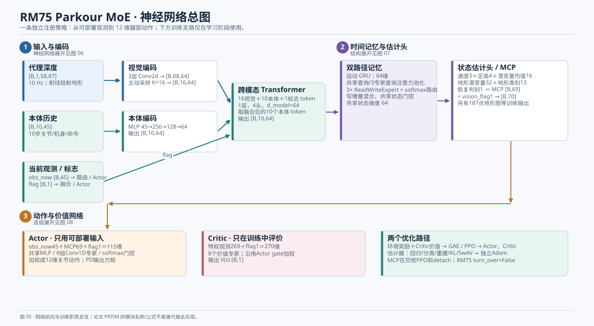
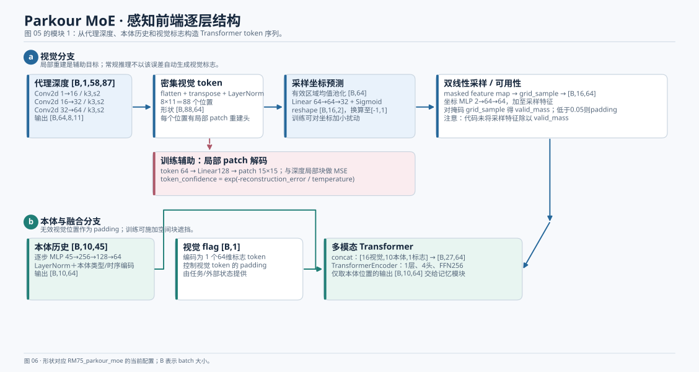
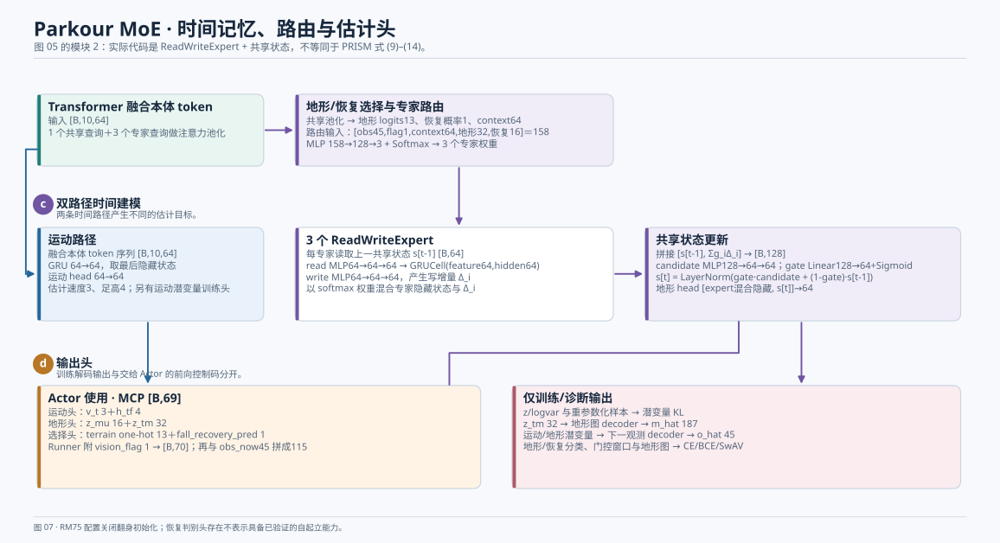
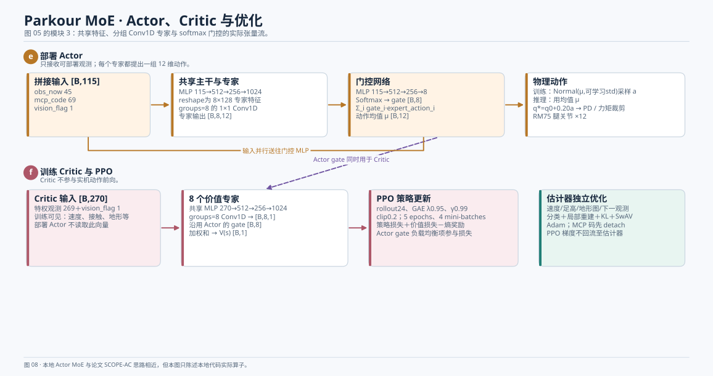

# RM75 Parkour MoE：单一主方案的神经网络架构

> 静态核对日期：2026-09-25；源码基线 `fdc748240e135c944f788ebe546b9a4e27e2bac1`。本页只描述注册任务 `RM75_parkour_moe`，与[整个仓库的三任务总览](README.md)配套。这里的“实现”表示代码路径存在，不代表给定 checkpoint 已通过实验。

## 先确定这套方案与平地、坡地的关系

**写一套以多地形通行为目标的强化控制方案，建议以 Parkour MoE 为主线。**它包含完整的视觉/本体估计器、多地形训练环境、动作专家、Critic、PPO 和关节执行闭环。平地小跑可以写为对照基线；视觉坡地可以写为特定坡面任务的残差适配分支。

这个建议不等于“Parkour 是平地 Actor 与坡地残差 Actor 相加后的升级版”。源码里三者分别注册、实例化和训练；平地配置与视觉坡地配置还继承了 Parkour 的 RM75 环境基础配置。视觉坡地**配置了**从平地权重热启动，Parkour 任务没有配置从视觉坡地接着训练。因此，论文式方法图应画**一条 Parkour 网络**，将平地/坡地放在实验对照或阶段说明，而不是作为它的运行时子网络。证据见[任务注册](../../legged_gym/envs/__init__.py)、[平地配置继承](../../legged_gym/envs/rm75/rm75_config_flat_trot.py)、[坡地配置与热启动](../../legged_gym/envs/rm75/rm75_config_visual_ramp_trot.py)、[Parkour 策略配置](../../legged_gym/envs/rm75/rm75_config_parkour_moe.py)。

这也限定了方案所能声称的目标：`RM75_parkour_moe` 的速度命令范围和奖励与“最终固定 3 m/s 的平地小跑”不同；它不能代替后者的速度达标证据。RM75 还关闭了翻身初始化，不能把恢复头画成已验证的自起立能力。

## 图 05：从观测到动作的完整网络

图中的三段与以下展开图一一对应：[图 06 感知与融合](06_parkour_perception.svg) → [图 07 时间记忆与估计头](07_parkour_memory.svg) → [图 08 Actor、Critic 与训练](08_parkour_actor_critic.svg)。蓝/青/紫/橙框是部署前向计算；红框包含训练阶段才需要的特权输入和损失。

### 整体输入与输出

| 网络入口或出口 | 当前 RM75 Parkour 配置中的形状 | 是否部署时可用 |
| --- | --- | --- |
| 当前本体观测 `obs_now` | `[B,45]` | 是 |
| 本体历史 `proprio_seq` | `[B,10,45]` | 是 |
| 代理深度 `depth_seq` | `[B,1,58,87]` | 仿真/配置的深度输入；实机须有相应深度源 |
| 视觉标志 `vision_flag` | `[B,1]` | 是，当前常规入口由任务或外部状态给定 |
| 特权 Critic 观测 | `[B,269]`，附标志后 `[B,270]` | 否，仅训练 |
| 估计器 `mcp_code` | `[B,69]`，附标志后 `[B,70]` | 是，内部推理特征 |
| Actor 拼接输入 | `[B,115] = [B,45+69+1]` | 是 |
| Actor 动作 | `[B,12]` | 是；经 PD 驱动 12 个腿关节 |
| Critic 价值 | `[B,1]` | 否，仅训练 |

## 图 06：感知前端怎样形成 token

**视觉路径：**`[B,1,58,87]` 经过三层 `3×3, stride=2` 的 Conv2d，通道依次为 `1→16→32→64`；所得特征图为 `[B,64,8,11]`，展平后是 **88 个 64 维视觉 token**。每个 token 另送局部 patch 解码器，用于重建对应深度区域并计算训练误差。当前源码还由该误差计算 `token_confidence`。见[深度编码与局部解码](../../rsl_rl/rsl_rl/modules/actor_critic_parkour_moe.py)。

主动采样器先对当前**有效掩码内**的特征做均值池化，再经 `Linear 64→64→32 + Sigmoid` 预测 16 组二维坐标；坐标转为 `grid_sample` 所需的 `[-1,1]` 范围。双线性取样得到 `[B,16,64]`，坐标编码网络 `2→64→64` 提供位置特征。对掩码单独取样形成 `valid_mass`，低于配置阈值 `0.05` 的采样点被标记为 padding。**本地代码没有将采样特征除以 `valid_mass`**，因此不应直接照写 PRISM 论文式 (8)。见[主动采样器](../../rsl_rl/rsl_rl/modules/actor_critic_parkour_moe.py)。

**本体路径：**10 个历史观测逐步经过 `45→256→128→64` 的 MLP，形成 `[B,10,64]`。视觉标志编码成 1 个 token。最多 `16+10+1=27` 个 token 经一层、四头、宽度 64、前馈宽度 256 的 Transformer；后续时间网络取**融合后的 10 个本体位置 token**，形状 `[B,10,64]`。视觉可用性与 token padding 会改变融合时哪些视觉 token 可被关注。见[Transformer 构造](../../rsl_rl/rsl_rl/modules/actor_critic_parkour_moe.py)、[融合后的 token 切片](../../rsl_rl/rsl_rl/modules/actor_critic_parkour_moe.py)。

## 图 07：时间网络不是论文的 MATE-GRU 公式

时间建模有两条并行路径：

1. **运动路径：**融合 token 序列进入一个 GRU，使用最后隐藏状态生成速度、足高，以及训练中使用的运动潜变量与下一观测预测。
2. **地形路径：**一个共享查询和三个专家查询从同一 token 序列中池化出特征。共享特征预测 13 类地形概率、恢复概率和上下文特征；路由器读取当前观测 45 维、视觉标志 1 维、上下文 64 维、地形特征 32 维、恢复特征 16 维，共 158 维，经 `158→128→3 + Softmax` 输出三个记忆专家权重。

每个 `ReadWriteExpert` 读取旧共享状态、运行自己的 `GRUCell`，再写出 64 维增量。令旧共享状态为 `s_prev`、三个专家增量为 `Δ_i`、路由权重为 `g_i`，实际更新的骨架是：

\[
\Delta=\sum_{i=1}^{3}g_i\Delta_i,\qquad
c=F_c([s_{prev},\Delta]),\qquad
u=\sigma(F_u([s_{prev},\Delta])),
\]

\[
s_{new}=\operatorname{LayerNorm}\bigl(u\odot c+(1-u)\odot s_{prev}\bigr).
\]

专家隐藏状态的加权结果与新共享状态一起送入地形预测头。这里的**读共享状态—写增量—总门控**与 PRISM 文中“每专家分别计算 reset/update/candidate 门再汇总”的 MATE-GRU 公式不同。见[ReadWriteExpert](../../rsl_rl/rsl_rl/modules/actor_critic_parkour_moe.py)、[路由与共享状态更新](../../rsl_rl/rsl_rl/modules/actor_critic_parkour_moe.py)。

估计器的**前向控制码**精确由下列量拼接：

\[
\underbrace{v_t^{(3)}}_{\text{速度}}\;\Vert\;
\underbrace{h_{tf}^{(4)}}_{\text{足高}}\;\Vert\;
\underbrace{z_{\mu}^{(16)}}_{\text{潜变量均值}}\;\Vert\;
\underbrace{z_{tm}^{(32)}}_{\text{地形潜变量}}\;\Vert\;
\underbrace{c_{terrain}^{(13)}}_{\text{类别 one-hot}}\;\Vert\;
\underbrace{c_{recovery}^{(1)}}_{\text{恢复判别}}=69\text{维}.
\]

训练时另有 `z_logvar`、187 点高度图 `m_hat`、45 维下一观测 `o_hat` 等解码输出。Actor 用的是 `z_mu` 而非训练时重参数化抽样的 `z_t`。见[输出头与控制码拼接](../../rsl_rl/rsl_rl/modules/actor_critic_parkour_moe.py)。

## 图 08：八个动作专家及训练 Critic

**Actor：**`[B,115]` 同时走专家与门控两路。专家路的共享 MLP 为 `115→512→256→1024`，再按 `8×128` 分组，由 `groups=8` 的 `1×1 Conv1D` 输出 `[B,8,12]`；门控 MLP 为 `115→512→256→8 + Softmax`，得到 `[B,8]` 权重。专家动作加权后得到 `[B,12]` 动作均值。训练时策略分布围绕该均值采样；确定性推理直接使用均值。控制目标为 `q*=q0+0.20a`，再经 PD、力矩限制作用于腿部。见[专家和门控实现](../../rsl_rl/rsl_rl/modules/utils.py)、[Actor-Critic](../../rsl_rl/rsl_rl/modules/actor_critic_parkour_moe.py)、[关节力矩计算](../../legged_gym/envs/base/legged_robot.py)。

**Critic：**特权观测 269 维附 1 维标志，得到 `[B,270]`。其共享 MLP、分组 Conv1D 产生 8 个价值专家结果 `[B,8,1]`；当前实现沿用 Actor 计算的 8 个门控权重加权，输出一个价值 `[B,1]`。Critic 只服务训练，不是部署 Actor 的额外输入。见[Critic 专家值融合](../../rsl_rl/rsl_rl/modules/actor_critic_parkour_moe.py)。

**两条更新路：**Actor/Critic 使用环境奖励、GAE、PPO clip 和 Actor 门控负载均衡项更新；估计器使用速度/足高/地形图/下一观测回归、类别损失、局部重建、潜变量 KL、SwAV 等监督，由独立 Adam 更新。Runner 在把 69 维控制码和视觉标志送给 PPO 之前执行 `detach`，因此不能描述为 PPO 损失从 Actor 直接端到端更新整套估计器。见[扩展 PPO](../../rsl_rl/rsl_rl/algorithms/ppo_parkour_moe.py)、[估计器训练调用](../../rsl_rl/rsl_rl/runners/onpolicyrunner_parkour_moe.py)。

## 写成论文方法章节时的建议顺序

| 章节 | 只写这一条 Parkour 主方案的内容 |
| --- | --- |
| A · 任务与观测 | 固定臂 RM75、地球重力、13 类地形配置、当前观测/历史/深度、12 维动作 |
| B · 视觉稀疏表征 | 三层 CNN、局部重建、空间遮挡、16 点主动采样、位置编码与 token padding |
| C · 跨模态时间估计 | 本体 MLP、Transformer、运动 GRU、3 个读写专家、共享状态、输出头 |
| D · 动作与价值网络 | 8 专家 Actor MoE、门控加权、非对称 Critic、PD 执行 |
| E · 训练 | PPO 与估计器辅助损失的两条更新路、地形课程和动力学随机化 |
| F · 实验 | 分地形成功率、速度/姿态/力矩、消融、视觉扰动与 MuJoCo 复核，按实际 checkpoint 填数值 |

**需要明确留白：**RM75 `turn_over=False`；常规推理的视觉标志尚不能等同论文图 9 的已验证自动切换；当前任务是地球重力下的固定臂腿部控制。若论文目标改成 3 m/s 平地/35° 坡地达标，应另取对应注册任务和 checkpoint 作证据，不能由 Parkour 网络结构替代这些实验。
