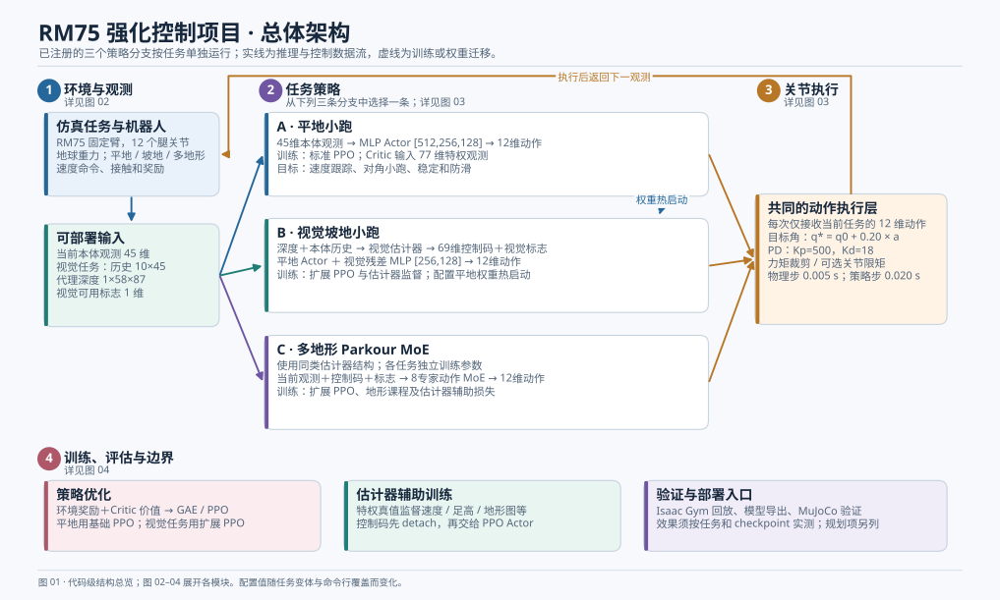
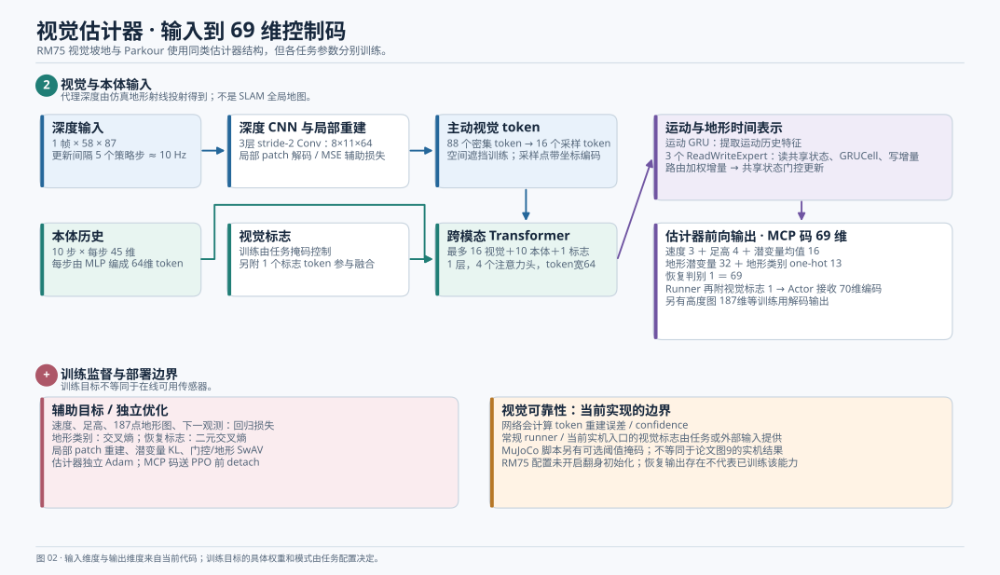
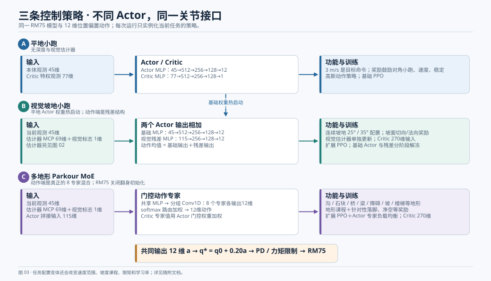
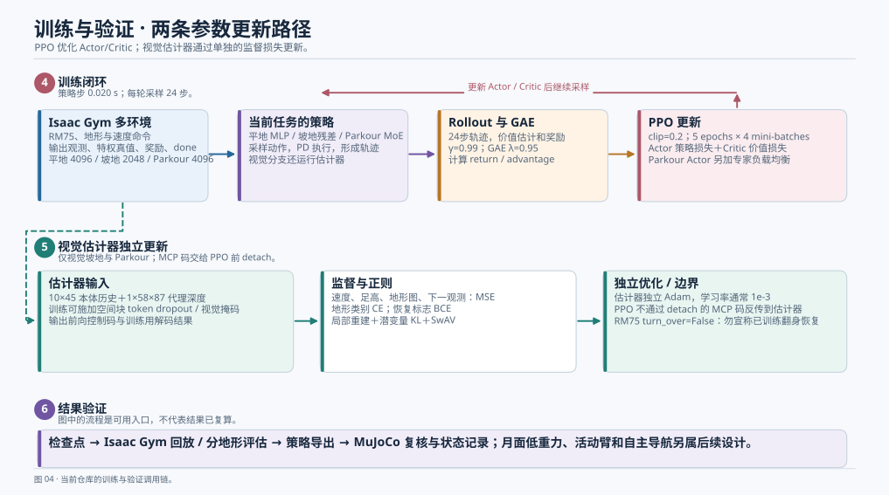

# RM75 强化控制代码架构图与输入输出说明

> 核对日期：2026-09-25。源码基线：`fdc748240e135c944f788ebe546b9a4e27e2bac1`。本文描述本地**注册任务与当前代码**，不是训练成功率报告，也不将 PRISM 论文的公式直接套到本仓库。

## 如何读这组图

先看[图 01：总体架构](01_overview.svg)，按编号展开至[图 02：视觉估计器](02_estimator.svg)、[图 03：三种控制策略](03_policies.svg)、[图 04：训练与验证](04_training.svg)。若要只写 Parkour 一套方案，继续读[Parkour 单方案神经网络详解](PARKOUR_NETWORK.md)和[图 05–08](05_parkour_network.svg)。图中实线表示一次推理/控制的数据传递，虚线表示训练监督或权重迁移；三条策略分支是**互斥的注册任务**，不是同一次推理串联的三层控制器。每图还提供同名 PNG，便于插入不支持 SVG 的文档。



## 1. 项目边界与任务入口

当前 RM75 策略控制 **12 个腿关节**。机械臂关节在训练 URDF 中固定，其质量与惯量仍属于机器人动力学。仿真重力是 `[0, 0, -9.81] m/s²`。月面低重力、活动机械臂足臂协同、SLAM 自主导航属于后续设计，不能标作这些注册任务的已有结果。

入口为 `legged_gym/scripts/train.py` → `task_registry` → 任务环境与配置 → Runner → Actor/Critic、估计器与优化器。三个主要任务族如下：

| 任务族 | 注册环境与策略 | 功能目标 | 与其他分支关系 |
| --- | --- | --- | --- |
| `RM75_flat_trot_3ms` 及限矩/新模型变体 | `RM75FlatTrotRobot`；`ActorCritic` MLP；基础 PPO | 地球重力平地上的速度跟踪、对角小跑与稳定控制 | 可作为视觉坡地的权重热启动来源；`3ms` 指 **3 m/s 目标速度** |
| `RM75_visual_ramp_trot_3ms_*` 及新模型坡地变体 | `RM75VisualRampTrotRobot`；视觉估计器＋`ActorCriticVisualResidual`；扩展 PPO | 连续上坡—平台—下坡上的速度跟踪与步态适应 | 载入平地 Actor 参数，并训练视觉残差；不采用 8 专家 Actor |
| `RM75_parkour_moe` | `Go2ParkourRobot` 环境类＋RM75 配置；视觉估计器＋`ActorCriticParkourMoE`；扩展 PPO | 沟、石块、桥、梁、障碍、坡、楼梯等多地形通行 | 独立任务；动作端采用 8 专家 MoE；RM75 配置 `turn_over=False` |

**源码入口：**[任务注册](../../legged_gym/envs/__init__.py)、[平地配置](../../legged_gym/envs/rm75/rm75_config_flat_trot.py)、[坡地配置](../../legged_gym/envs/rm75/rm75_config_visual_ramp_trot.py)、[Parkour 配置](../../legged_gym/envs/rm75/rm75_config_parkour_moe.py)。`25deg`、`35deg`、`hip84` 等是配置条件，不能据名字推断任务已通过测试。

## 2. 共同机器人、观测与关节接口

### 2.1 Actor 当前本体观测

基础环境将下列量拼接成每步 **45 维**向量 `obs_now`：

| 分量 | 维度 | 用途 |
| --- | ---: | --- |
| 机身角速度 | 3 | 当前转动情况 |
| 机身坐标系中的投影重力 | 3 | 姿态/倾斜线索 |
| 速度与转向命令 | 3 | 期望运动方向与速度 |
| 相对默认姿态的腿关节角 | 12 | 当前关节位置 |
| 腿关节角速度 | 12 | 当前关节运动 |
| 上一步动作 | 12 | 给策略提供最近控制历史 |
| **合计** | **45** | 当前 Actor 可部署观测 |

平地 Critic 使用 **77 维**特权观测。视觉坡地与 Parkour 环境提供 **269 维**特权观测，Actor-Critic 再附加 1 维视觉标志，故其 Critic 实际输入为 **270 维**。特权量可包含仿真中的速度、接触、驱动、地形扫描与任务标签；它们不直接喂给部署 Actor。见[观测构造](../../legged_gym/envs/go2/go2_env.py)、[Parkour 特权观测追加](../../legged_gym/envs/go2/go2_parkour_env.py)。

### 2.2 动作如何变成物理控制

三类 Actor 均输出 12 维连续动作 `a`，对应四条腿各三个关节。位置控制名义目标是：

\[
q^* = q_0 + 0.20a,
\]

其中 `q_0` 为**配置中的默认关节角**，不是每一步的实测关节角。PD 按位置误差和关节速度产生力矩；实现还叠加零位偏移、动作裁剪、力矩裁剪及某些任务的单关节限矩。RM75 基础刚度 `Kp=500`、阻尼 `Kd=18`。物理时间步 `0.005 s`，每 4 个物理步调用一次策略，所以策略周期 `0.020 s`，即 50 Hz。见[RM75 控制配置](../../legged_gym/envs/rm75/rm75_config_parkour_moe.py)、[PD 计算](../../legged_gym/envs/base/legged_robot.py)。

## 3. 视觉估计器：输入、计算与输出



视觉坡地和 Parkour 共用**估计器结构**，各注册任务分别持有和训练参数。估计器使用代理深度，并非在线 SLAM 构建的全局地图。以下尺寸对应当前视觉 RM75 配置：

| 阶段 | 输入 | 输出 | 作用与源码 |
| --- | --- | --- | --- |
| 深度采集 | 仿真地形与机器人/相机姿态 | `depth [B,1,58,87]` | 射线投射、裁剪、缩放、噪声与归一化；深度更新间隔 5 个策略步。见[代理深度生成](../../legged_gym/envs/go2/go2_parkour_env.py) |
| 深度编码 | 当前深度帧 | `[B,88,64]`，空间网格 `8×11` | 三层 stride-2 Conv；局部 patch 解码提供重建损失和 token confidence。见[编码器](../../rsl_rl/rsl_rl/modules/actor_critic_parkour_moe.py) |
| 主动视觉采样 | 88 个密集 token、有效掩码 | 最多 16 个采样 token，单个宽 64 | 坐标 MLP＋sigmoid、双线性 `grid_sample`、坐标编码。训练中可以叠加空间块 dropout。见[采样器](../../rsl_rl/rsl_rl/modules/actor_critic_parkour_moe.py) |
| 本体历史编码 | `proprio_history [B,10,45]` | 10 个 64 维本体 token | 每步本体观测经 MLP 编码 |
| 跨模态融合 | 16 视觉 token＋10 本体 token＋1 视觉标志 token | 融合 token 序列 | 1 层、4 头 Transformer；无视觉时视觉 token 被遮挡 |
| 时间表示 | 融合 token、上一步共享状态 | 运动特征与新共享状态 | 一条运动 GRU；3 个 `ReadWriteExpert` 各自读共享状态、经 GRUCell 产生写入增量，再门控更新共享状态。见[估计器专家](../../rsl_rl/rsl_rl/modules/actor_critic_parkour_moe.py) |
| 控制码 | 上述时间表示 | `mcp_code [B,69]` | 供坡地残差 Actor 或 Parkour Actor 使用 |

控制码的实际拼接为：

| 控制码分量 | 维度 | 含义 |
| --- | ---: | --- |
| `v_t` | 3 | 估计的速度 |
| `h_tf` | 4 | 估计的四足高度 |
| `z_mu` | 16 | 潜变量均值，作为可部署控制特征 |
| `z_tm` | 32 | 受地形图重建约束的地形潜变量 |
| `terrain_pred_onehot` | 13 | 估计的地形类别 one-hot |
| `fall_recovery_pred` | 1 | 恢复状态判别头输出；存在该维不等于 RM75 已训练翻身能力 |
| **合计** | **69** | `mcp_code` |

Runner 将**视觉标志 1 维**附于该码，生成 70 维 Actor 编码；再与当前 45 维本体观测拼接，得到视觉坡地和 Parkour 的 **115 维 Actor 输入**。估计器另解码 187 点地形高度图和下一观测，用于训练。见[输出拼接](../../rsl_rl/rsl_rl/modules/actor_critic_parkour_moe.py)、[Runner 拼接与 detach](../../rsl_rl/rsl_rl/runners/onpolicyrunner_parkour_moe.py)。

> **视觉可靠性边界：**网络确实计算局部重建误差及 `token_confidence`。常规 Runner 和当前实机 Go2 入口的 `vision_flag` 由训练任务或外部输入提供；MuJoCo 脚本另有可选的置信度阈值逻辑。不能把这些入口混写成同一项已验证的“自动视觉—盲行—视觉”实机能力。详见[常规推理](../../rsl_rl/rsl_rl/runners/onpolicyrunner_parkour_moe.py)、[MuJoCo 掩码](../../deploy/deploy_mujoco/deploy_go2.py)、[当前 Go2 实机入口](../../deploy/deploy_real/deploy_real_go2_parkour_moe.py)。

## 4. 三种控制架构的输入输出



### 4.1 A · 平地小跑

`obs_now [B,45] → Actor MLP 45-512-256-128-12 → a [B,12]`。Critic 为 `privileged_obs [B,77] → MLP 77-512-256-128-1 → V [B,1]`。训练时 Actor 作为高斯策略的均值网络，动作从分布采样；确定性推理使用均值。奖励包含速度跟踪、对角接触/占空比、姿态、能耗、滑移与动作平滑。这里的 3 m/s 是课程最终**目标命令**，不是本文件确认的实测速度。见[平地任务](../../legged_gym/envs/rm75/rm75_config_flat_trot.py)、[平地小跑奖励](../../legged_gym/envs/rm75/rm75_flat_trot_env.py)、[基础 Actor-Critic](../../rsl_rl/rsl_rl/modules/actor_critic.py)。

### 4.2 B · 视觉坡地小跑

估计器生成的 70 维编码分流到视觉残差 Actor。当前 45 维观测同时进入平地基础 Actor。两个输出相加：

\[
\mu(o_t,c_t)=\mu_{\text{base}}(o_t)+s_r\mu_{\text{res}}([o_t,c_t]),\qquad s_r=1.
\]

基础 Actor 仍为 `45-512-256-128-12`，残差 MLP 为 `115-256-128-12`，Critic 接收 270 维。残差末层零初始化；训练配置先冻结视觉残差、再分阶段解冻基础 Actor，并可从平地 checkpoint 热启动。地形任务主要是连续坡面与平面，包含 25° 和 35° 配置及单关节限矩变体。见[坡地策略配置](../../legged_gym/envs/rm75/rm75_config_visual_ramp_trot.py)、[残差网络](../../rsl_rl/rsl_rl/modules/actor_critic_visual_residual.py)、[坡地环境奖励](../../legged_gym/envs/rm75/rm75_visual_ramp_trot_env.py)。

### 4.3 C · 多地形 Parkour MoE

Actor 接收 `obs_now [B,45]` 和上述 `mcp_code+flag [B,70]`，拼成 115 维。共享 MLP 提取特征，分组 Conv1D 实现 8 个动作专家；softmax 门控为每个专家分配权重，得到 12 维动作。Critic 对 270 维特权输入计算 8 个专家价值，并按 Actor 门控权重融合。环境覆盖沟、石块、桥、悬空梁/石、跨栏、坡、通道、楼梯与平地等。RM75 配置明确 `turn_over=False`，因此恢复头存在于网络中，不等于该 RM75 任务已启用翻身恢复训练。见[Parkour 环境配置](../../legged_gym/envs/rm75/rm75_config_parkour_moe.py)、[专家实现](../../rsl_rl/rsl_rl/modules/utils.py)、[Parkour Actor-Critic](../../rsl_rl/rsl_rl/modules/actor_critic_parkour_moe.py)。

## 5. 训练与验证流程图



**策略训练路径：**环境采集每轮 24 个策略步的 `obs / action / reward / done / value` → GAE 计算 advantage 与 return → PPO 更新 Actor 和 Critic。共同参数是 `γ=0.99`、GAE `λ=0.95`、PPO clip `0.2`、每轮 5 个学习 epoch 与 4 个 mini-batch。平地采用基础 `PPO`，视觉分支采用 `PPOParkourMoE`。[基础 PPO](../../rsl_rl/rsl_rl/algorithms/ppo.py)、[视觉任务 Runner](../../rsl_rl/rsl_rl/runners/onpolicyrunner_parkour_moe.py)、[扩展 PPO](../../rsl_rl/rsl_rl/algorithms/ppo_parkour_moe.py)。

**估计器训练路径：**仿真特权真值监督速度、足高、187 点地形图、下一观测、地形类别、恢复标志；此外有局部 patch 重建、潜变量 KL 和门控/地形 SwAV。估计器通过独立优化器更新，Runner 把 `mcp_code.detach()` 后才交给 PPO，故不能声称 PPO 损失直接端到端反传到估计器。估计器代码虽计算一项门控负载均衡统计量，但当前 `total_loss` 未加入它；Actor MoE 的负载均衡项则确实加入 PPO 损失。[估计器损失](../../rsl_rl/rsl_rl/algorithms/ppo_parkour_moe.py)、[Runner 控制码](../../rsl_rl/rsl_rl/runners/onpolicyrunner_parkour_moe.py)。

**验证路径：**checkpoint → Isaac Gym `play.py` 回放或 `evaluate_parkour_moe.py` 分地形统计 → 模型导出 → MuJoCo `deploy_go2.py` 进行跨仿真器复核及状态记录。图中的箭头表示仓库已有入口，不表示这些变体已有某个成功率。见[训练入口](../../legged_gym/scripts/train.py)、[评估入口](../../legged_gym/scripts/evaluate_parkour_moe.py)、[MuJoCo 入口](../../deploy/deploy_mujoco/deploy_go2.py)。

## 6. 参数差异速览

| 参数 | 平地小跑基线 | 视觉坡地基线 | RM75 Parkour MoE |
| --- | ---: | ---: | ---: |
| 并行环境数 | 4096 | 2048 | 4096 |
| Actor 当前本体观测 | 45 | 45 | 45 |
| 本体历史 | 无估计器 | 10×45 | 10×45 |
| 代理深度 | 无 | 1×58×87 | 1×58×87 |
| 主动视觉 token | 无 | 16 | 16 |
| 估计器读写专家 | 无 | 3 | 3 |
| 动作专家 | 单 MLP | 基础 MLP＋残差 MLP | 8 个 MoE 专家 |
| Actor 输入/路径 | 45→12 | 45→12，加 115→12 | 115→8专家→12 |
| Critic 输入 | 77 | 270 | 270 |
| 基线 Actor-Critic 学习率 | `5e-4` | `2e-4` | `2e-4` |
| 估计器学习率 | 不适用 | `1e-3` | `1e-3` |
| 任务坡度或速度 | 最终目标 3 m/s | 25°/35°；目标 3 m/s | 多地形与变化命令 |

限矩任务与 V1.1 新模型适配任务继承上述相应架构，主要覆盖关节力矩上限、默认关节角、奖励权重、课程和学习率，不构成第四种 Actor 架构。有效值还可能受命令行覆盖。见[新模型地球重力配置](../../legged_gym/envs/rm75/rm75_config_newmodel_earth_torque_pipeline.py)。

## 7. 论文式章节如何对应这份代码

| 论文部分 | 可据源码写入的内容 | 需要单独实测或另行实现的内容 |
| --- | --- | --- |
| 问题与平台 | 固定臂 RM75、地球重力、腿部位置偏置动作、平地/坡地/多地形任务 | 月面接触、活动臂控制与协同目标 |
| 方法 A · 观测与控制 | 45维观测、视觉输入、PD/限矩闭环 | 实机传感器与时间同步实测 |
| 方法 B · 平地基线 | MLP Actor-Critic、对角小跑奖励、速度课程 | 速度误差、占空比及稳定性统计 |
| 方法 C · 视觉坡地 | 多模态估计器、基础 Actor＋视觉残差、热启动 | 坡度与视觉损坏的消融和泛化统计 |
| 方法 D · 多地形策略 | 3读写估计器专家、8动作专家、地形课程、辅助目标 | 分地形多种子结果及可靠性开关验证 |
| 实验与结论 | 已有训练、回放、MuJoCo 与指标记录入口 | 统一 checkpoint、实验条件、样本量和统计区间 |

## 8. 维护与复核

四张图由 [`render_diagrams.py`](render_diagrams.py) 生成。修改注册任务、网络维度或训练机制后，先核对上面的源码，再运行：

```text
python doc/control_architecture/render_diagrams.py
```

目前这组图经过静态源码核对和图像视觉检查；未启动 Isaac Gym、训练、MuJoCo 或实机验证。图中的“实现”表示代码路径和配置存在，不表示每个任务已达到目标速度、坡度或通行成功率。
