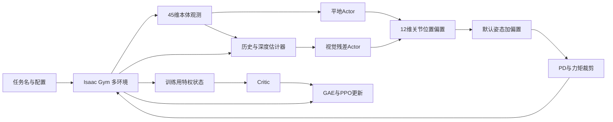

# 月面四足机器人智能控制：项目源码技术审计报告

审计日期：2026-09-14。对象：本地 `rm75-trot-slope-rl` 工作副本；Git HEAD：`fdc748240e135c944f788ebe546b9a4e27e2bac1`。

本报告依据实际注册任务、Python 配置继承、环境与算法调用链、URDF/MJCF 文件进行核对。没有运行 Isaac Gym、训练、MuJoCo 或加载 checkpoint；“有实现”不等于“效果已经验证”。用户给出的服务器环境是背景条件，本轮运行位置为 Windows，审计脚本使用本机 Python 3.13.9。未修改任何算法、训练配置或机器人资产。

## 1. 先回答项目当前实现了什么

**目前可以准确概括为：地球重力下，带固定机械臂的四足机器人，使用 PPO 训练十二个腿部关节，实现平地小跑及视觉连续坡地适应，并提供仿真回放、导出和数据记录工具。当前注册训练链尚未实现活动机械臂控制与月面低重力足臂协同。**

| 用户关心的问题 | 源码结论 |
|---|---|
| 功能范围 | 平地 3 m/s 目标小跑、25°/35°连续坡地、不同关节力矩上限、新模型平地适配与细化、独立的 Parkour MoE 多地形任务；数字是任务目标或地形配置，不代表通过验收 |
| 训练入口 | [legged_gym/scripts/train.py](D:/codex_workplace/月面四足强化学习/rm75-trot-slope-rl/legged_gym/scripts/train.py) → `task_registry` → 环境 + runner → `learn()` |
| 核心环境 | 平地 `RM75FlatTrotRobot`；坡地 `RM75VisualRampTrotRobot`；各有力矩受限子类；一般 Parkour 使用 `Go2ParkourRobot` |
| PPO 来自哪里 | 仓库自带的 [rsl_rl](D:/codex_workplace/月面四足强化学习/rm75-trot-slope-rl/rsl_rl)，含基础 PPO 与项目扩展 `PPOParkourMoE`；不能当作当前上游库原封不动的版本 |
| Actor 观测 | 单步本体观测 45 维；视觉任务还通过独立估计器接收历史和深度 |
| 动作 | 12 维、相对默认姿态的关节位置偏置，经 PD 转力矩；不是策略直接输出末端轨迹或 19 维全身力矩 |
| 奖励 | 按任务选择；平地与坡地有完整清单；通用 Parkour 另有落脚点、抬脚、窄桥及楼梯奖励 |
| Trot | 显式对角接触与接触占空比奖励；不是预设正弦相位时钟驱动 |
| Slope | 高度场生成上坡—平台—下坡，再转训练三角网格；坡地任务有局部切向/法向奖励 |
| 重力 | 全部 14 个 RM75 注册任务继承 `[0,0,-9.81] m/s²` |
| 课程学习 | 有速度范围、奖励系数、坡地等级上限、表现驱动等级调整；并非所有任务启用全部课程 |
| 随机化 | 摩擦、恢复系数、质量、质心、PD、零位、驱动强度、延迟、推扰与观测噪声；新模型平地分支减弱或关闭部分项目 |
| RM75 模型 | 当前资产路径为 [RM75/urdf/Z1_NOLIDARV11_locked_arm.urdf](D:/codex_workplace/月面四足强化学习/rm75-trot-slope-rl/RM75/urdf/Z1_NOLIDARV11_locked_arm.urdf)；含完整臂体质量/惯量 |
| 足臂协同架构 | 当前为固定臂负载下的腿部 RL；没有查到注册的活动臂协同训练任务 |
| 腿与臂由谁控制 | 腿由策略 + PD；臂关节为 fixed 约束，无独立臂控制器 |
| 主要缺口 | 低重力训练/评估、月壤接触模型、七关节活动臂控制、末端目标/观测/奖励、全身协同实验与完整统计验证 |

## 2. 项目地图与实际调用链

以下路径均以本仓库为基准；各奖励的可点击绝对路径及行号见本报告配套的奖励证据文档。

| 文件/目录 | 实际作用 |
|---|---|
| [legged_gym/envs/__init__.py](D:/codex_workplace/月面四足强化学习/rm75-trot-slope-rl/legged_gym/envs/__init__.py) | 任务注册表；决定任务名对应哪个环境类和两套配置；当前有 14 个 RM75 任务 |
| [legged_gym/scripts/train.py](D:/codex_workplace/月面四足强化学习/rm75-trot-slope-rl/legged_gym/scripts/train.py) | 训练入口；创建环境、runner，恢复课程计数并训练 |
| [legged_gym/utils/task_registry.py](D:/codex_workplace/月面四足强化学习/rm75-trot-slope-rl/legged_gym/utils/task_registry.py) | 参数覆盖、实例化、选择 runner、resume/warm-start、模型文件检查 |
| [legged_gym/utils/helpers.py](D:/codex_workplace/月面四足强化学习/rm75-trot-slope-rl/legged_gym/utils/helpers.py) | 命令行参数、配置转字典、Isaac Gym 仿真参数解析 |
| [legged_gym/envs/base/legged_robot.py](D:/codex_workplace/月面四足强化学习/rm75-trot-slope-rl/legged_gym/envs/base/legged_robot.py) | 刚体仿真、PD、reset、终止、公共奖励、随机化、课程、状态缓冲 |
| [legged_gym/envs/base/legged_robot_config.py](D:/codex_workplace/月面四足强化学习/rm75-trot-slope-rl/legged_gym/envs/base/legged_robot_config.py) | 基础物理、观测缩放、噪声、PPO/CTS/MoE 默认配置 |
| [legged_gym/envs/go2/go2_env.py](D:/codex_workplace/月面四足强化学习/rm75-trot-slope-rl/legged_gym/envs/go2/go2_env.py) | 45 维 Actor 观测、非对称 Critic 观测、髋关节正则 |
| [legged_gym/envs/go2/go2_parkour_env.py](D:/codex_workplace/月面四足强化学习/rm75-trot-slope-rl/legged_gym/envs/go2/go2_parkour_env.py) | 深度代理、足高/地形标识、Parkour 奖励、无进展/越界终止 |
| [legged_gym/envs/go2/go2_config_vanilla.py](D:/codex_workplace/月面四足强化学习/rm75-trot-slope-rl/legged_gym/envs/go2/go2_config_vanilla.py) | **RM75 间接继承的 GO2Cfg 来源**；不是仅看同目录 `go2_config.py` 就能得到正确参数 |
| [legged_gym/envs/rm75/rm75_config_parkour_moe.py](D:/codex_workplace/月面四足强化学习/rm75-trot-slope-rl/legged_gym/envs/rm75/rm75_config_parkour_moe.py) | RM75 资产、默认关节姿态、PD、Parkour 环境配置 |
| [legged_gym/envs/rm75/rm75_config_flat_trot.py](D:/codex_workplace/月面四足强化学习/rm75-trot-slope-rl/legged_gym/envs/rm75/rm75_config_flat_trot.py) | 平地小跑任务及基础 PPO 配置 |
| [legged_gym/envs/rm75/rm75_flat_trot_env.py](D:/codex_workplace/月面四足强化学习/rm75-trot-slope-rl/legged_gym/envs/rm75/rm75_flat_trot_env.py) | 对角接触奖励、占空比、足端滑移、触地终止 |
| [legged_gym/envs/rm75/rm75_config_visual_ramp_trot.py](D:/codex_workplace/月面四足强化学习/rm75-trot-slope-rl/legged_gym/envs/rm75/rm75_config_visual_ramp_trot.py) | 25°坡地、深度估计器、残差策略、热启动 |
| [legged_gym/envs/rm75/rm75_visual_ramp_trot_env.py](D:/codex_workplace/月面四足强化学习/rm75-trot-slope-rl/legged_gym/envs/rm75/rm75_visual_ramp_trot_env.py) | 坡度检测、切向速度、法向姿态/高度、上下坡占空比、完成判据 |
| [legged_gym/envs/rm75/rm75_config_visual_ramp_trot_35deg.py](D:/codex_workplace/月面四足强化学习/rm75-trot-slope-rl/legged_gym/envs/rm75/rm75_config_visual_ramp_trot_35deg.py) | 坡度上限及地形等级课程调整 |
| [legged_gym/envs/rm75/rm75_torque_limited_flat_trot_env.py](D:/codex_workplace/月面四足强化学习/rm75-trot-slope-rl/legged_gym/envs/rm75/rm75_torque_limited_flat_trot_env.py) | 按关节名字将 hip/thigh/calf 力矩上限写入 DOF 属性 |
| [legged_gym/envs/rm75/rm75_torque_limited_visual_ramp_trot_env.py](D:/codex_workplace/月面四足强化学习/rm75-trot-slope-rl/legged_gym/envs/rm75/rm75_torque_limited_visual_ramp_trot_env.py) | 坡地任务对应力矩限制 |
| [legged_gym/envs/rm75/rm75_config_newmodel_earth_torque_pipeline.py](D:/codex_workplace/月面四足强化学习/rm75-trot-slope-rl/legged_gym/envs/rm75/rm75_config_newmodel_earth_torque_pipeline.py) | V1.1 默认关节角校准、地球平地适配、84/150 与 100/150 分支和细化任务 |
| [rsl_rl/rsl_rl/runners/on_policy_runner.py](D:/codex_workplace/月面四足强化学习/rm75-trot-slope-rl/rsl_rl/rsl_rl/runners/on_policy_runner.py) | 基础 PPO rollout、更新、日志、存取模型 |
| [rsl_rl/rsl_rl/algorithms/ppo.py](D:/codex_workplace/月面四足强化学习/rm75-trot-slope-rl/rsl_rl/rsl_rl/algorithms/ppo.py) | 高斯策略概率比、PPO clip、价值损失、熵、KL 自适应学习率 |
| [rsl_rl/rsl_rl/modules/actor_critic.py](D:/codex_workplace/月面四足强化学习/rm75-trot-slope-rl/rsl_rl/rsl_rl/modules/actor_critic.py) | 平地 Actor 与 Critic MLP |
| [rsl_rl/rsl_rl/storage/rollout_storage.py](D:/codex_workplace/月面四足强化学习/rm75-trot-slope-rl/rsl_rl/rsl_rl/storage/rollout_storage.py) | rollout 缓冲、GAE、return、优势标准化、mini-batch |
| [rsl_rl/rsl_rl/runners/onpolicyrunner_parkour_moe.py](D:/codex_workplace/月面四足强化学习/rm75-trot-slope-rl/rsl_rl/rsl_rl/runners/onpolicyrunner_parkour_moe.py) | 历史/深度估计、视觉标志、PPO 与估计器分开更新 |
| [rsl_rl/rsl_rl/algorithms/ppo_parkour_moe.py](D:/codex_workplace/月面四足强化学习/rm75-trot-slope-rl/rsl_rl/rsl_rl/algorithms/ppo_parkour_moe.py) | PPO 扩展及估计器监督/重建损失 |
| [rsl_rl/rsl_rl/modules/actor_critic_visual_residual.py](D:/codex_workplace/月面四足强化学习/rm75-trot-slope-rl/rsl_rl/rsl_rl/modules/actor_critic_visual_residual.py) | 平地基础 Actor + 视觉残差 Actor，坡地任务实际使用 |
| [rsl_rl/rsl_rl/modules/actor_critic_parkour_moe.py](D:/codex_workplace/月面四足强化学习/rm75-trot-slope-rl/rsl_rl/rsl_rl/modules/actor_critic_parkour_moe.py) | 视觉/本体估计器、Transformer、估计器专家及一般 Parkour Actor MoE |
| [legged_gym/utils/terrain.py](D:/codex_workplace/月面四足强化学习/rm75-trot-slope-rl/legged_gym/utils/terrain.py)、`terrain_mgdp.py` | 地形类型、难度、连续坡/坑/石块/楼梯/崎岖地面生成 |
| [RM75/urdf/](D:/codex_workplace/月面四足强化学习/rm75-trot-slope-rl/RM75/urdf)、[RM75/meshes/](D:/codex_workplace/月面四足强化学习/rm75-trot-slope-rl/RM75/meshes) | 训练模型与网格；目录中包含不同年代资产，不能认为全部同时使用 |
| [Z1_NOLIDARV1.1.SLDASM/urdf/](D:/codex_workplace/月面四足强化学习/rm75-trot-slope-rl/Z1_NOLIDARV1.1.SLDASM/urdf) | 原始 CAD 导出 URDF，含可动臂关节 |
| [tools/prepare_new_model.py](D:/codex_workplace/月面四足强化学习/rm75-trot-slope-rl/tools/prepare_new_model.py) | 固定 link1–link7，保留臂质量/惯量，补四个独立足接触 body |
| [resources/robots/RM75/](D:/codex_workplace/月面四足强化学习/rm75-trot-slope-rl/resources/robots/RM75) | MuJoCo 机器人与地形场景，包括重复坡及 hfield 场景 |
| [legged_gym/scripts/play.py](D:/codex_workplace/月面四足强化学习/rm75-trot-slope-rl/legged_gym/scripts/play.py) | Isaac Gym 推理、策略导出及记录 |
| [legged_gym/utils/exporter.py](D:/codex_workplace/月面四足强化学习/rm75-trot-slope-rl/legged_gym/utils/exporter.py) | 模型与视觉推理 bundle 导出 |
| [legged_gym/scripts/evaluate_parkour_moe.py](D:/codex_workplace/月面四足强化学习/rm75-trot-slope-rl/legged_gym/scripts/evaluate_parkour_moe.py) | 分地形/等级多试验评估，生成 CSV、JSON、Markdown |
| [deploy/deploy_mujoco/deploy_go2.py](D:/codex_workplace/月面四足强化学习/rm75-trot-slope-rl/deploy/deploy_mujoco/deploy_go2.py) | 通用 MuJoCo 部署入口，也支持 RM75；记录关节、基座、功率、COM |
| [deploy/deploy_mujoco/configs/RM75_parkour_moe.yaml](D:/codex_workplace/月面四足强化学习/rm75-trot-slope-rl/deploy/deploy_mujoco/configs/RM75_parkour_moe.yaml) | RM75 MuJoCo 默认策略、场景、PD、观测、相机配置 |
| `legged_gym/scripts/plot_rm75_*_checkpoints.py` | RM75 checkpoint 动态指标绘图工具 |
| `deploy/deploy_mujoco/export_rm75_dynamics_*.py` | 动力学记录整理与图表导出 |
| [tools/export_parkour_moe_trt_assets.py](D:/codex_workplace/月面四足强化学习/rm75-trot-slope-rl/tools/export_parkour_moe_trt_assets.py) 等 | ONNX/TensorRT 导出、构建、验证、性能测试工具；存在工具不代表本机已具备引擎 |
| [good_result/](D:/codex_workplace/月面四足强化学习/rm75-trot-slope-rl/good_result) | 已有图像结果；本轮未复算，不能据此推定当前工作副本的训练性能 |
| [legged_gym/utils-new/](D:/codex_workplace/月面四足强化学习/rm75-trot-slope-rl/legged_gym/utils-new) | 另一路工具代码，含 GaitScheduler；当前 RM75 训练链未查到接入 |



图中残差分支适用于视觉坡地；平地只有基础 Actor。一般 `RM75_parkour_moe` 改用 Actor MoE，不能把图中的残差相加误写成它的结构。

## 3. 算法、网络与参数

### 3.1 实际是三种策略结构

| 任务族 | Runner / 算法 | Actor | Critic |
|---|---|---|---|
| flat_trot、newmodel_earth_flat | OnPolicyRunner / PPO | 45→512→256→128→12，ELU，线性输出 | 77→512→256→128→1 |
| visual_ramp、newmodel_earth_ramp | OnPolicyRunnerParkourMoE / PPOParkourMoE | 基础 45→512→256→128→12，加视觉残差 115→256→128→12 | 270→512→256→128→1 |
| RM75_parkour_moe | OnPolicyRunnerParkourMoE / PPOParkourMoE | 115 维输入，8 专家 MoE，配置 hidden_dims=[512,256,128] | 270 维输入，专家价值输出按 Actor gate 融合；前层共享，末层专家化 |

所有任务动作都是 12 维。算法名含 MoE 不意味着坡地 Actor 本身是 8 专家：坡地明确选择 `ActorCriticVisualResidual`，其 evaluate 返回一个常量 gate。

平地策略采用对角高斯分布，均值来自 Actor，12 个标准差为可学习参数：

$$\pi_\theta(a_t\mid o_t)=\mathcal N(\mu_\theta(o_t),\operatorname{diag}(\sigma^2)).$$

训练从分布采样；确定性推理返回均值。动作之后还会被环境裁剪，Actor 末层没有 tanh。坡地均值为：

$$\mu=\mu_{base}(o_t)+s_r\mu_{res}([m_t,b_t,o_t]),\qquad s_r=1.$$

残差最后一层以零初始化；视觉坡地默认前 250 次迭代冻结残差、前 1000 次冻结基础 Actor，之后基础 Actor 使用主学习率的 0.25 倍。新模型坡地为 250/1500 次、比例 0.20。这些是代码中的训练安排，不是策略效果结论。

### 3.2 共同 PPO 参数与分支差异

共同参数：γ=0.99，GAE λ=0.95，PPO ε=0.2，value_loss_coef=1，use_clipped_value_loss=True，5 个 learning epochs，4 个 mini-batches，rollout horizon=24，Adam，梯度范数上限 1，desired_kl=0.01。来自 `LeggedRobotCfgPPO` / `LeggedRobotCfgParkourMoE`，由子类覆盖部分参数。

| 分支 | 学习率 | 熵系数 | schedule | 环境数 | 每次 rollout 样本/mini-batch |
|---|---:|---:|---|---:|---:|
| 原始平地 cold-start | 5e-4 | 0.01 | adaptive | 4096 | 98304 / 24576 |
| 平地 100/160 | 2e-4 | 0.003 | fixed | 4096 | 98304 / 24576 |
| 视觉坡地基础 | 2e-4 | 0.005 | fixed | 2048 | 49152 / 12288 |
| 视觉坡地硬限矩（100/160、100/150、84/150） | 1.5e-4 | 0.003 | fixed | 2048 | 49152 / 12288 |
| 新模型平地 100/150、84/150 | 7.5e-5 | 0.0005 | fixed | 4096 | 98304 / 24576 |
| 新模型平地 refine | 2.5e-5 | 0.0001 | fixed | 4096 | 98304 / 24576 |
| 新模型平地 refine_v2 | 1.5e-5 | 0.00005 | fixed | 4096 | 98304 / 24576 |
| 新模型视觉坡地 | 1.25e-4 | 0.002 | fixed | 2048 | 49152 / 12288 |
| 一般 RM75 Parkour | 2e-4 | 0.01 | adaptive | 4096 | 98304 / 24576 |

精确逐任务覆盖值以 [source_audit/effective_configs.json](D:/codex_workplace/月面四足强化学习/rm75-trot-slope-rl/doc/source_audit/effective_configs.json) 为准。命令行 `--num_envs` 等还会改变运行值。每次 PPO 更新遍历 5×4=20 个 mini-batches；24 步不是 episode 长度。训练物理步长 0.005 s，decimation=4，因此策略步长 0.02 s、50 Hz，单环境 rollout 长 0.48 s。名称 `3ms` 在这些配置中指 3 m/s 任务目标，不是 3 毫秒控制周期。

adaptive 时：平均 KL 大于 2×target 则学习率除 1.5；小于 target/2 且为正则乘 1.5，上下限为 1e-5 和 1e-2。fixed 分支虽然保留 desired_kl 字段，不启动这段自适应逻辑。

### 3.3 与 PPO/GAE 数学公式对应

令 $d_t$ 是代码存储的 done，$\tilde r_t$ 是加入 timeout bootstrap 后的奖励，$V_t=V_\psi(o_t^{priv})$：

$$\delta_t=\tilde r_t+\gamma(1-d_t)V_{t+1}-V_t,$$
$$\hat A_t=\delta_t+\gamma\lambda(1-d_t)\hat A_{t+1},\quad \hat R_t=\hat A_t+V_t.$$

`rollout_storage.py:123` 与 `rollout_storage_parkour_moe.py:75` 从后向前递推；随后在 rollout 上做优势标准化。代码没有单独训练 Q 网络，使用 V 和优势估计。

$$\rho_t=\exp(\log\pi_\theta(a_t|o_t)-\log\pi_{old}(a_t|o_t)),$$
$$L^{clip}=\mathbb E\left[\min(\rho_t\hat A_t,\operatorname{clip}(\rho_t,1-\epsilon,1+\epsilon)\hat A_t)\right].$$

代码最小化 $-L^{clip}+c_vL_V-c_H\mathcal H$；价值剪裁以旧 V 为中心限制改变量，再取剪裁/未剪裁两种平方误差较大者。超时处理实际在 `process_env_step()` 将 $\gamma V_t$ 加入奖励，再存 done；不要在报告里声称代码直接从终止前最终观测重算 $V(s_{terminal})$。坡地 forward_completion 也使用这条 timeout 路径。

PPO 与 GAE 的文献入口分别为 [PPO 原论文](https://arxiv.org/abs/1707.06347) 和 [GAE 原论文](https://arxiv.org/abs/1506.02438)。本节具体递推及超时处理以仓库实现为依据。

### 3.4 视觉估计器并不等于额外环境奖励

估计器使用 10 帧×45 维本体历史、1 帧 58×87 深度；配置启用 16 个主动视觉 token、1 层 4-head Transformer、3 个估计器专家。其代码输出：

$$m_t=[\hat v_t^{(3)},\hat h_{feet}^{(4)},z_\mu^{(16)},z_{terrain}^{(32)},\hat y_{terrain}^{(13)},\hat y_{recovery}^{(1)}]\in\mathbb R^{69}.$$

其中地形预测以 argmax one-hot 输出，恢复标志阈值为 0.5。runner 再添加 1 维 vision_flag，得到 70 维编码；与当前 45 维观测拼接才是 Actor 的 115 维输入。Critic 是环境 269 维再加 vision_flag，共 270 维。

估计器独立 Adam，学习率 1e-3。损失包含速度/足高/187点地形图 MSE、运动/地形两路下一观测重建均值、地形分类交叉熵、恢复标志 BCE、局部 token 重建、潜变量 KL、SwAV；局部重建系数 0.05，SwAV 权重逐渐到 0.02。`update_estimator()` 内虽计算 load_balance_loss，但当前 total_loss 未将它相加，不能把日志项当成优化项。runner 将 mcp_code detach 后交给 PPO，估计器有自身监督更新路径。

## 4. MDP 与观测建模

可以以 $M=(S,A,P,R,\gamma)$ 写仿真任务，但需区分完整仿真状态和策略可见观测。完整状态包括浮动基座位姿速度、关节状态、地形、接触、随机动力学参数以及历史缓存；45 维 Actor 观测不包含所有这些量，更接近部分可观测控制。视觉历史用于补充信息，不能直接证明已经满足 Markov 性。

$$J(\theta)=\mathbb E_\pi\left[\sum_{t=0}^{T-1}\gamma^t r_t\right],\qquad o_t=h(s_t)+\eta_t.$$

Transition 是 PhysX 在每个策略步内执行四次物理推进后的结果；环境还更新命令、噪声、课程、接触历史等变量。它不是项目中单独学习的动力学预测器。

### 4.1 Actor 单步 45 维，顺序不能颠倒

| Python 切片 | 维数 | 内容 | 缩放 |
|---|---:|---|---:|
| 0:3 | 3 | base_ang_vel，机体系角速度 | 0.25 |
| 3:6 | 3 | projected_gravity，机体系单位重力方向 | 1 |
| 6:9 | 3 | commands[:3]：vx、vy、yaw-rate | [2,2,0.25] |
| 9:21 | 12 | dof_pos − default_dof_pos | 1 |
| 21:33 | 12 | dof_vel | 0.05 |
| 33:45 | 12 | self.actions，最近执行的策略动作 | 1 |

来源 `Go2Robot.compute_observations():23`。代码变量是 `self.actions`；从“下一次决策”视角看它就是上一动作。这里没有 base_lin_vel、接触、187点高度、机械臂关节或末端目标，也没有 sin/cos gait clock。线速度真值仅给 Critic；视觉估计器预测线速度可间接给 Actor。

projected_gravity：$g_B=R_{WB}^T[0,0,-1]^T$；是单位方向，不能从它的模长推断物理重力大小。噪声配置里的 `gravity=0.05` 是方向观测噪声，不是重力随机化。

### 4.2 非对称 Critic

基础顺序为：线速度3 + Actor对应内容45 + 足接触力模长4 + 力矩/限值12 + 差分关节加速度12 + 高度特征。

平地 measure_heights=False 时 `measured_heights=0` 为标量，因此最后只有 1 个高度特征：$\operatorname{clip}(z_B-0.5,-1,1)\times2.5$。总维数是 **77**，不是 76，也不是 263。

视觉任务高度网格 17×11=187，基础维数 263；`Go2ParkourRobot.compute_observations():1983` 添加足高4、terrain_id1、fall_recovery1，得到 269。地形 id 是 Critic 的一个数值标量；估计器输出的地形预测则是 13 维 one-hot，二者不要混淆。RM75 关闭翻身训练后，恢复标志头仍存在，不代表有恢复任务训练效果。

## 5. 动作和底层控制

`LeggedRobot._compute_torques():752` 实际使用 P 模式：

$$\bar a_t=\operatorname{clip}(a_t,-100,100),\quad q^*=q_0+0.20\bar a_t,$$
$$\tau_{PD}=K_p\odot(q^*-q+\Delta q_0)-K_d\odot\dot q,$$
$$\tau_{sim}=m\odot\operatorname{clip}(\tau_{PD},-\tau_{lim},\tau_{lim}).$$

名义 $K_p=500$ N·m/rad、$K_d=18$ N·m·s/rad；随机化乘子修正增益，$\Delta q_0$ 为电机零位偏差，$m$ 为驱动力乘子。每个物理子步重新算 PD。启用动作延迟时，在 0…4 中随机选择切换子步，之前沿用 last_actions，对应离散 0…20 ms 延迟。

**这是相对默认姿态的偏置，不是对上一关节目标累加增量。** 普通分支力矩先裁剪、再乘最大可到 1.1 的强度，最终物理力矩可能超过原裁剪上限；硬限矩分支将乘子限制到 ≤1。100/160、100/150、84/150 分别代表 hip与thigh 同组、calf 另一组，每组依关节名映射，不能理解成只有四个 hip 电机受限。

默认姿态也不是整个仓库统一：旧任务默认十二个角均为零；新模型 Earth 类设置 FL/RL hip=0.06、FR/RR hip=−0.06，前腿 thigh=0.70/calf=−1.20，后腿 thigh=0.75/calf=−1.175。其用途是适配 V1.1 导出模型的关节坐标。

## 6. 奖励函数：平地和坡地完整主表

以下 $f_i$ 是函数原始返回值，权重 $w_i$ 已包含正负号。当前小跑任务 only_positive_rewards=False：

$$r_t=\Delta t\sum_i w_i c_i(k)f_i(t),\qquad\Delta t=0.02\text{s}.$$

源码 `_prepare_reward_function()` 对非零权重乘 dt；普通项还乘相应课程系数。termination 在循环外添加，不乘普通课程系数。下面“惩罚”函数多数返回非负量，负号在权重，不能再额外加负号。

记 $[x]_+=\max(x,0)$，$\Delta a_t=a_t-a_{t-1}$；$v_B,\omega_B$ 为机体系速度，$v_W$ 为世界系速度；$u,n$ 为坡地切向与法向；$v_*=\text{terrain_target_speed}$；$I$ 为布尔指示。

| reward | 平地权重 | 视觉坡地基础权重 | 原始计算与目的 |
|---|---:|---:|---|
| termination | −2 | −2 | $I(done\land\neg timeout)$；失败惩罚 |
| tracking_lin_vel | 4 | 4 | 平地 $\exp(-\|c_{xy}-v_{B,xy}\|^2/0.20)$；坡地 $\exp(-((v_*-u^Tv_W)^2+v_{W,y}^2)/0.20)$ |
| tracking_ang_vel | 1 | 1 | $\exp(-(c_\omega-\omega_{B,z})^2/0.20)$ |
| trot_gait | 1.5 | 1.5 | 第7节的对角同步×交替×占空均衡×目标占空比×启用门控 |
| lin_vel_z | −1.5 | −1.5 | 平地 $v_{B,z}^2$；坡地 $(n^Tv_W)^2$，惩罚离开坡面的速度 |
| ang_vel_xy | −0.10 | −0.10 | $\omega_{B,x}^2+\omega_{B,y}^2$ |
| orientation | −1 | −1 | 平地 $g_{B,x}^2+g_{B,y}^2$；坡地 $(R^Tn)_x^2+(R^Tn)_y^2$ |
| correct_base_height | −2 | −2 | $(h-0.53)^2$；平地 h=z，坡地 h=(z−地面高度)n_z |
| torques | −2e-6 | −2e-6 | $\sum_j\tau_j^2$ |
| dof_acc | −1e-8 | −1e-8 | $\sum_j((\dot q_{t-1,j}-\dot q_{t,j})/\Delta t)^2$ |
| dof_power | −1e-6 | −1e-6 | $\sum_j\lvert\tau_j\dot q_j\rvert$；机械功率绝对值，不是实测电功率 |
| action_rate | −0.010 | −0.010 | $\sum_j(\Delta a_{t,j})^2$ |
| action_smoothness | −0.005 | −0.005 | $\sum_j(a_{t,j}-2a_{t-1,j}+a_{t-2,j})^2$ |
| collision | −2 | −2 | 被惩罚刚体中 $\|F\|>0.1$ 的数量，配置匹配 thigh/calf/base |
| dof_pos_limits | −3 | −3 | $\sum_j([q_{lo,j}-q_j]_+ + [q_j-q_{hi,j}]_+)$；lo/hi 是 soft_dof_pos_limit=0.90 收缩后的界限 |
| torque_limits | −0.01 | −0.01 | $\sum_j[\lvert\tau_j\rvert-0.90\tau_{lim,j}]_+$ |
| feet_contact_forces | −0.002 | −0.002 | $\sum_i[\|F_i\|-650]_+$ |
| feet_slip | −0.10 | −0.10 | 平地 $\sum_i I(F_{z,i}>5)\|v_{foot,i,xy}^W\|^2$；坡地使用三维足速平方 |
| feet_regulation | −0.02 | 未启用 | $\sum_i\|v_{foot,i,xy}^W\|^2\exp(-h_i/(0.025h_*))$，$h_i$ 是基座高度结合投影重力估算的足离地高度并裁到非负 |
| hip_to_default | −0.02 | −0.02 | 四个髋外展角 $\sum\lvert q_{hip}-q_{0,hip}\rvert$ |
| speed_tracking_error | 未启用 | −0.50 | $(v_*-u^Tv_W)^2$ |
| lateral_velocity | 未启用 | −0.40 | $v_{W,y}^2$ |
| downhill_overspeed | 未启用 | −1 | $I(slope<-\tan2°)[u^Tv_W-v_*]_+^2$ |

以上是基础平地与基础视觉坡地的完整非零项。新模型平地覆盖 yaw=2、trot=2、lin_vel_z=−2、torques=−3e-6、power=−1.5e-6、torque_limits=−0.02、slip=−0.25；soft_torque_limit=0.85，目标占空比=0.47。refine 覆盖 yaw=2.5、trot=3、slip=−0.30，并新增 trot_duty_balance=−30；refine_v2 为 trot=3.5、trot_duty_balance=−150。新增函数为 $\frac14\sum_i(e_i-d_*)^2$。其他力矩变体是否覆盖配置，以逐任务证据表为准。

### 6.1 一般 Parkour 分支的完整权重

`RM75_parkour_moe` 不沿用上面的 Trot scale 类。共有26个非零配置项：

| 项目 | 权重 | 计算说明 |
|---|---:|---|
| tracking_lin_vel | 1 | 指令与机体系水平速度指数跟踪，困难地形乘航向对齐；地形0/7达指令速度时可置1 |
| tracking_ang_vel | 0.5 | yaw-rate 指数跟踪，sigma见有效配置 |
| lin_vel_z | −2 | $v_{B,z}^2$ |
| ang_vel_xy | −0.05 | 水平角速度平方和 |
| correct_base_height | −1.5 | 地形采样估计离地高度误差平方；部分地形排除 |
| torques | −2e-6 | 力矩平方和 |
| dof_acc | −1e-8 | 关节差分加速度平方和 |
| dof_power | −2e-5 | 绝对机械功率和 |
| action_rate | −0.008 | 动作一阶差分平方和 |
| action_smoothness | −0.008 | 动作二阶差分平方和 |
| collision | −1.5 | 非期望触地数量 |
| dof_pos_limits | −2 | 超出软关节限位的距离和 |
| feet_regulation | −0.025 | 足速平方乘低足高指数项 |
| hip_to_default | −0.03 | 髋角偏离默认值绝对值和；窄桥地形排除 |
| stand_still | −0.5 | 命令速度<0.1时关节偏离默认值绝对值和，限平地类地形 |
| low_speed_when_commanded | −0.5 | $I(\|c\|>c_{min})[\min(\|c\|,v_{min})-\|v_{B,xy}\|]_+$ |
| hard_terrain_yaw_penalty | −0.2 | $I(heading\_conditioned)\omega_{B,z}^2$ |
| omni_target_yaw_error | −0.05 | 全向任务 $[\lvert wrap(\psi_*-\psi)\rvert-deadzone]_+^2$ |
| upward_foothold_clearance | 0.5 | 摆动且前方地面升高等条件成立时，对目标足高的指数跟踪，扣除腾空超时项；虽正权重，原值可为负 |
| targeted_foothold_touchdown | 0.5 | 有效目标、足够腾空后首次触地时 $\sum_i\exp(-\|p_{foot,xy}-p^*_{xy}\|^2/\sigma_p)$；目标由局部高度搜索得到 |
| single_bridge_narrow_stance | 0.5 | 窄桥时四足横向位置到带容差目标的指数误差均值 |
| flat_forward_speed | 1 | 速度搜索模式下正向速度截断值；当前 flat_speed_search_enabled=False，故此项实际为0 |
| flat_gait | −0.8 | 过早离地计数 + 0.75×低接触占空缺额 + 1.60×后足占空缺额 + 0.80×后足不平衡；仅相应平地命令条件 |
| stairs_omni_lead_touch_above | 0.6 | 触发支撑转移阶段时，领足新触高台数量/领足数量 |
| stairs_omni_trail_followup | 1 | 跟随时间窗内，后随足首次到高台数量/后随足数量 |
| stairs_omni_support_transfer_progress | 0.8 | 活跃阶段内 $\operatorname{clip}(\Delta x,0,0.04)/0.04$ |

地形 mask、首次接触判断、足高搜索、接触计时是公式成立的组成部分。[source_audit/reward_evidence.md](D:/codex_workplace/月面四足强化学习/rm75-trot-slope-rl/doc/source_audit/reward_evidence.md) 提供全部14任务权重和实际覆盖函数原文；helper 逻辑继续按其中源码位置追踪。未出现在某任务非零 scales 中的函数不应写为该任务正在优化，例如基础 Trot 没有 feet_air_time、EE tracking。

## 7. Trot 的真实实现

足序 FL、FR、RL、RR。令当前接触 $C_i=I(F_{z,i}>5)$；用 $c_i=C_i\lor C_{i,t-1}$ 滤掉单帧接触丢失，EMA 更新 $e_i\leftarrow0.99e_i+0.01c_i$。

$$S_{sync}=\operatorname{clip}(1-\tfrac12(|c_{FL}-c_{RR}|+|c_{FR}-c_{RL}|),0,1),$$
$$S_{opp}=|\tfrac12(c_{FL}+c_{RR})-\tfrac12(c_{FR}+c_{RL})|,$$
$$\bar e=\tfrac14\sum_i e_i,\quad S_{bal}=\operatorname{clip}(1-\tfrac{\frac14\sum_i|e_i-\bar e|}{0.15},0,1),$$
$$f_{trot}=S_{sync}S_{opp}S_{bal}\exp(- (\bar e-d_*)^2/0.04)I(v_{cmd}>0.3).$$

平地基础 $d_*=0.50$；坡地在平地0.50、上坡0.58、下坡0.54之间按坡地因子混合；新模型平地为0.47，refine还收紧均衡容差。该奖励鼓励对角交替，并用长期占空比防止只靠同一对角站立；**不规定步频、不生成足轨迹、不保证严格周期**。仓库的 `utils-new/gait_scheduler.py` 存在显式相位工具，但未接入这些注册任务，不应将其公式拼入当前控制链。

## 8. 坡地：有法向感知，但限定于纵向坡

`terrain_mgdp.py:322` 的 half_sloped_terrain 按高度场建立底部平台、约2 m上坡、约2 m上平台、下坡、末平台。连续坡场景与比例配置见 `rm75_config_visual_ramp_trot.py`：70%坡、30%平地，10行×20列，水平分辨率0.05 m、垂直0.005 m，无叠加 roughness。它不是每个时间步随机改变坡面。

课程地形行 i 的 difficulty=i/10，归一化 difficulty/0.9 后乘25°或35°。因此35°分支十级的设计角约为0、3.89、7.78、11.67、15.56、19.44、23.33、27.22、31.11、35°；高度离散化后局部数值坡度有误差。35°是最大生成坡度，不等于最大稳定坡度已经测得。

局部斜率用世界 x 方向中心差分：

$$s=\frac{h(x+0.2,y)-h(x-0.2,y)}{0.4},\quad u=\frac{(1,0,s)}{\sqrt{1+s^2}},\quad n=\frac{(-s,0,1)}{\sqrt{1+s^2}}.$$

当前点与前方1.2 m点的绝对斜率取较大者，按1.5°到4°线性映射为 raw_factor。坡地因子 $\beta_t=\max(raw,0.98\beta_{t-1})$；目标速度 $v_*=3+\beta(v_{slope}-3)$。坡速目标由1.0逐渐到1.2，再到1.5 m/s；平地目标3 m/s。**Actor 的 commands 配置仍是3 m/s，奖励内部目标另行减速，不能把两个数当作同一变量。**

法向通过高度场真值估计，不是网络直接输出的地形法向。Actor 通过代理深度获取前视信息；训练 reward 有特权地形访问。这个 normal 只估算纵向坡，令横向导数为零，不能扩写为通用三维 terrain-normal-aware WBC。

### 8.1 课程与终止

平地 terrain.curriculum=False，但 command_range_curriculum 非空：初始0.5–1.0 m/s，分阶段提升至第18000次起固定3 m/s；奖励 tracking/trot/slip 另有线性系数课程。`commands.curriculum=False` 不代表这些按迭代调度的课程不存在。

坡地 terrain.curriculum=True：父类用行进距离决定升/降级；子类按迭代限制最高等级。35°基础任务第22000次放开第9级。坡中随机出生样本不按普通路程表现升降级，仍应用等级上限；第1000次后对坡地样本按0.5概率在上坡/平台/下坡区间出生。

平地20 s，坡地12 s，时间步超过 max_episode_length 时 timeout。两者都增加基座接触力>1 N终止；坡地还有无进展3 s及越界等。坡地前向越界且无其他失败被记为 forward_completion，同时置 timeout 进行 bootstrap，不罚 termination；侧向/后向越界及同时摔倒属于失败。评估时应区分完成、摔倒、无进展、超时。

## 9. 随机化与月面环境边界

| 项目 | 基础平地/基础视觉坡地 | 新模型平地适配 |
|---|---|---|
| 摩擦 | [0.6,1.4] | [0.8,1.2] |
| 恢复系数 | [0,0.2] | [0,0.1] |
| 基座附加质量 | [−4,4] kg | [−2,2] kg |
| link质量倍率 | [0.95,1.05] | [0.98,1.02] |
| 基座COM各轴偏移 | [−0.02,0.02] m | [−0.01,0.01] m |
| Kp/Kd倍率 | [0.9,1.1] | [0.95,1.05] |
| 电机零位 | [−0.02,0.02] rad | [−0.01,0.01] rad |
| 电机强度 | 基础[0.9,1.1]；硬限矩[0.9,1.0] | [0.95,1.0] |
| 动作延迟 | 开启 | 关闭 |
| 推扰 | 每6 s，水平速度幅值0.25、角速度幅值0.30 | 关闭 |

这些参数由 `_process_rigid_shape_props`、`_process_rigid_body_props`、reset 和 step 应用，不全是逐步随机。推扰实现直接改 root velocity，不是以 N 为单位给定的推力曲线。关节阻尼常数/PD阻尼与“关节阻尼独立随机化”也不是同一件事，当前未查到后者开关。

本体噪声为均匀噪声；名义幅度由 noise_scales×noise_level×对应obs_scale形成。基础角速度噪声0.2、关节角0.01、关节速度1.5、重力方向0.05。深度另有安装位置/角度误差、0.05 m高斯噪声及视觉token丢弃。精确配置见配套JSON。

所有14任务物理重力均−9.81；没有查到活动训练链的重力随机化、月壤沉陷/剪切/颗粒求解器。现状是刚体接触与摩擦变化，不能写成真实松软月壤。`plot_rm75_visual_ramp_checkpoints.py` 虽列出 lunar 任务名称，但注册表没有对应任务，绘图分支不是月面训练实现证据。

面向月面的拟补充内容应单独写成计划：配置用户目标1.62 m/s²及训练/部署一致性；重整速度、接触力、腾空/姿态奖励；必要时引入低重力课程与真实测得的接触参数；如果暂只用刚性地面，应明确月壤是摩擦等效近似。不要仅把重力数值改掉就宣称完成月面适应。

## 10. 机械臂、自由度与足臂耦合

静态 XML 解析结果：

| 资产 | 关节类型统计 | link质量总和 |
|---|---|---:|
| 原始 `Z1_NOLIDARV1.1.SLDASM.urdf` | 18 revolute + 1 continuous + 3 fixed，即19个活动关节 | 97.73625 kg |
| 当前训练 `Z1_NOLIDARV11_locked_arm.urdf` | 12 revolute + 14 fixed | 97.89625 kg |
| 旧 `RM75_locked_arm.urdf` / `Z1_NOLIDAR.urdf` | 12 revolute + 13 fixed | 95.89525 kg |

质量是URDF各link惯性质量求和，尚未包括运行随机化。当前训练模型增添四个0.04 kg独立足刚体，计0.16 kg。配置注释中“80 kg”或“95.9 kg”并不准确反映当前V1.1资产。

`prepare_new_model.py` 将 link1_joint…link7_joint 改为 fixed，同时移除轴/限位等活动关节描述；保留质量惯量和连接关系。十二个腿部角由策略控制，七个机械臂角无动作输入。固定臂的质量/COM影响整机动力学，但没有运动机械臂的惯性反作用训练。

源码能确认七关节臂模型存在；仅凭目录名及 Z1 命名不能确认硬件厂商型号、标定或真实SDK已经接通。当前未查到注册控制链使用 Jacobian逆解、零空间优化、EE位置/姿态目标、WBC/QP或独立 manipulation RL。

方案未来可以讨论 $x_{ee}=f(q_{arm})$、$J_{arm}\in\mathbb R^{6\times7}$ 和零空间目标，但这些应列入**拟实现设计**。浮动基座下还需考虑基座运动对末端速度的贡献，而不能把固定基座机械臂的 $\dot x=J_{arm}\dot q_{arm}$ 直接作为整机协同模型。

## 11. 训练、推理与测试命令

下列命令在服务器已配置好的 Isaac Gym 环境、仓库根目录执行。本轮只核实入口与参数，没有启动。task默认是go2，必须明确指定RM75任务。

```bash
# 原始平地任务：没有热启动路径要求，但当前资产/零位兼容性仍需首轮核验
python legged_gym/scripts/train.py --task=RM75_flat_trot_3ms --headless --num_envs=4096

# V1.1平地适配：需要该任务runner.warm_start_path指向的已有checkpoint
python legged_gym/scripts/train.py --task=RM75_newmodel_earth_flat_hip84_knee150 --headless

# V1.1视觉坡地：需要对应selected/model.pt
python legged_gym/scripts/train.py --task=RM75_newmodel_earth_ramp35_hip84_knee150 --headless

# Isaac Gym回放：LOAD_RUN替换成真实日志子目录；checkpoint也应改成已有编号
python legged_gym/scripts/play.py --task=RM75_flat_trot_3ms --load_run=LOAD_RUN --checkpoint=25000 --num_envs=1

# MuJoCo默认RM75 Parkour bundle回放；不能将这个配置直接当作所有flat策略配置
python deploy/deploy_mujoco/deploy_go2.py --config=RM75_parkour_moe.yaml --duration=20

# 通用Parkour评估入口示例：等级默认one_based；跳过不对应本轮目标的模式
python legged_gym/scripts/evaluate_parkour_moe.py --task=RM75_parkour_moe --load_run=LOAD_RUN --checkpoint=30000 --levels=1,3,5,7,10 --forward_terrains=ramp --skip_recovery --skip_omni --skip_blind --trials_per_case=256
```

评估脚本会为测试配置地形/命令等条件，不等同于原样重跑训练环境；用于视觉残差坡地时，应核对其坡地奖励内部目标速度、课程计数和试验速度是否一致。上述示例只是已核实的命令接口，不能替代专项测试协议。

`task_registry.py:132` 对缺失 warm-start 文件直接报错。本副本没有 `logs/` 目录，无法确认服务器checkpoint已同步；历史PNG也不能代替权重。resume恢复训练状态，warm_start转移权重后迭代归零，二者课程起点不同。

## 12. 已发现的实现/复现风险

| 问题 | 证据与影响 | 本轮处理 |
|---|---|---|
| 分阶段脚本等待10000，但配置8000 | `run_rm75_newmodel_earth_pipeline.py` 的Stage A按model_10000.pt判断完成；当前FlatAdapt runner max_iterations=8000，warm_start归零；没有既有合格文件时正常本次训练不能满足等待条件 | 记录，未修改 |
| 所有RM75任务当前指向V1.1锁臂资产，但旧任务默认角仍全零 | `rm75_config_parkour_moe.py` 与新模型配置对比；旧policy在旧模型中烘焙的坐标偏移不自动等价于新URDF零角 | 需按真实checkpoint来源核对，不可凭任务名热启动 |
| MuJoCo默认配置与新模型训练不自动一致 | 默认YAML default_angles全零，旧MJCF关节坐标；MJCF默认motor限值200/320，硬限矩实验为100/160、100/150或84/150；部署支持CLI覆盖限值，但不能假定已使用 | 后续逐实验记录URDF/MJCF、零位、限矩和策略 |
| 部分脚本含lunar名称但未注册任务 | 绘图variants不等于训练定义 | 不作为已实现月面能力 |
| Python 3.8下资产准备工具兼容性 | `prepare_new_model.py` 使用 `ET.indent`（Python 3.9起），现成资产可直接读，但在用户3.8环境重生成需处理 | 未改；不影响本轮静态解析 |
| 环境依赖未按用户服务器复验 | setup.py还含旧依赖约束；不能从源码声明推定与给定PyTorch/CUDA组合全部可运行 | 未安装、未启动仿真 |

这些是源码审计结论，优先级取决于下一步是写方案、复现实验还是改造控制。没有把潜在兼容风险写成已经发生的训练失败。

## 13. 仿真测试报告应记录什么

现有 `MujocoStateRecorder` 记录 time、关节角速度/加速度、力矩命令与执行力矩、动作、目标角、关节误差、命令、基座位姿/速度/加速度、基座与整机COM、正功率/带符号功率/绝对功率，保存NPZ。`evaluate_parkour_moe.py` 输出 results.csv、trials.csv、summary.json、summary.md；可作为专项统计扩展起点。

| 指标 | 建议定义/边界 | 当前可用性 |
|---|---|---|
| 平地速度RMSE、yaw-rate RMSE | 对同坐标系命令与实测值计算；记录稳态窗口 | 有基础状态，需统一统计 |
| 坡地速度误差 | 相对 $u^Tv_W$ 和内部目标 $v_*$；同时记录坡角，避免只看body vx | 环境可算，通用NPZ需补坡度/目标字段 |
| 姿态误差 | 分别报告世界竖直与坡地法向误差 | 姿态已有；坡法向需记录 |
| 基座高度 | 平地高度与坡法向离地高度分开 | 有状态，可扩展 |
| 跌倒率、完成率 | 摔倒/越界/无进展/时间截断分开计数，给样本数和置信区间 | 环境已有原因mask，需核对评估定义 |
| 稳定最大坡度 | 固定速度、摩擦、负载、种子与成功阈值下寻找边界 | 尚无本轮验证结论 |
| 滑移 | 接触期间足端切向速度RMS或滑移距离 | 训练有接触/足速，通用NPZ当前未列足接触力，需补日志 |
| Trot一致性 | 对角接触同步率、各足占空比、左右差、实际步频 | 训练有接触历史，需输出独立指标，不能仅报trot reward |
| 力矩/关节约束 | 峰值、RMS、饱和时间比例、越界次数 | 大部分原始量已有；限值随实验存档 |
| 功率/能量/COT | $E_{abs}=\int\sum\lvert\tau\dot q\rvert dt$；$COT=E/(mgd)$，明确E口径及g | 可计算机械指标；没有电机效率模型，勿称实测电能 |
| 动作平滑 | 一阶/二阶动作差分，注明未除dt的版本 | 动作日志已有 |
| COM与基座漂移 | 整机COM、基座位移与roll/pitch，不能混用base COM和system COM | MuJoCo日志已有字段 |
| 扰动恢复时间 | 扰动开始到速度/姿态回到预定容差并持续一段时间 | 需添加明确触发时间与阈值 |
| EE位置/姿态误差 | 末端目标与实际变换误差，需统一基坐标系或世界系 | 现任务没有目标/控制/专用日志 |

建议实验矩阵：平地/上坡/下坡×坡度等级×速度×力矩档×摩擦×负载；之后再增加低重力条件。每组固定checkpoint/随机种子集合，分别评价训练内与训练外条件。消融可比较无trot项、无法向奖励、无视觉残差、无随机化；这些是后续试验计划，本轮未进行。

## 14. 方案设计可用表述与下一步

**可用于“已完成基础”描述：** 当前系统构建了带固定机械臂负载的四足机器人并行仿真训练环境，采用非对称Actor-Critic与PPO进行腿部运动控制。策略根据本体状态生成十二维关节位置偏置，通过PD控制转换为关节力矩。平地任务利用对角足接触和占空比奖励引导小跑；连续坡地任务在预训练运动策略基础上加入视觉残差策略，并基于地形切向速度、法向姿态和离地高度设计适应性奖励。训练引入任务相关课程和动力学随机化，现有实现工作于地球重力及刚性接触环境。

**拟开展部分应另列：** 月面低重力训练和验证、月壤等效/沉陷接触模型、活动机械臂运动控制及足臂协调、末端目标与整机稳定性联合奖励、低重力全身动力学测试。不要将固定臂质量补偿写作末端操作控制，也不要将生成35°坡面写作已经稳定通过35°。

当前章节建议分为“已实现运动控制基础”“面向月面的扩展设计”“足臂协同拟实现架构”“验证方案与验收指标”。学习顺序先围绕平地45维观测→12维动作/PD→奖励→Return/V/Advantage→GAE/PPO，再进入视觉估计器/残差、坡地参考系、课程/随机化，最后讨论活动机械臂；Q和Bellman用于解释，不必先实现DQN。

每个学习专题继续使用用户指定的 A–H 模板：源码位置、解决的问题、直观原理、推导、变量含义、代码对应、方案表述、测试指标。本轮已建立源码证据基础，未将全部26项学习课程冒充为已讲授完成。

## 15. 配套证据和复核范围

配套目录 [doc/source_audit/](D:/codex_workplace/月面四足强化学习/rm75-trot-slope-rl/doc/source_audit) 包含：

- `effective_configs.json`：14任务展开继承后的环境/训练配置，便于准确追踪每个分支。
- `reward_evidence.md`：每任务非零奖励权重、实际方法覆盖位置及44个不同实现的源码原文。
- `asset_inventory.json`：4个URDF关节类型、关节名及质量求和。
- `source_sha256.json`：本次核对的源码文件指纹，便于之后判断版本是否变动。

复核通过：配置独立加载、14任务识别、每个非零奖励找到实际实现、URDF XML解析、观察维数与代码拼接对照。没有进行GPU仿真、策略效果复现、硬件SDK控制或用户服务器依赖测试。报告中的方案建议与尚缺能力均不计入“当前已验证能力”。
